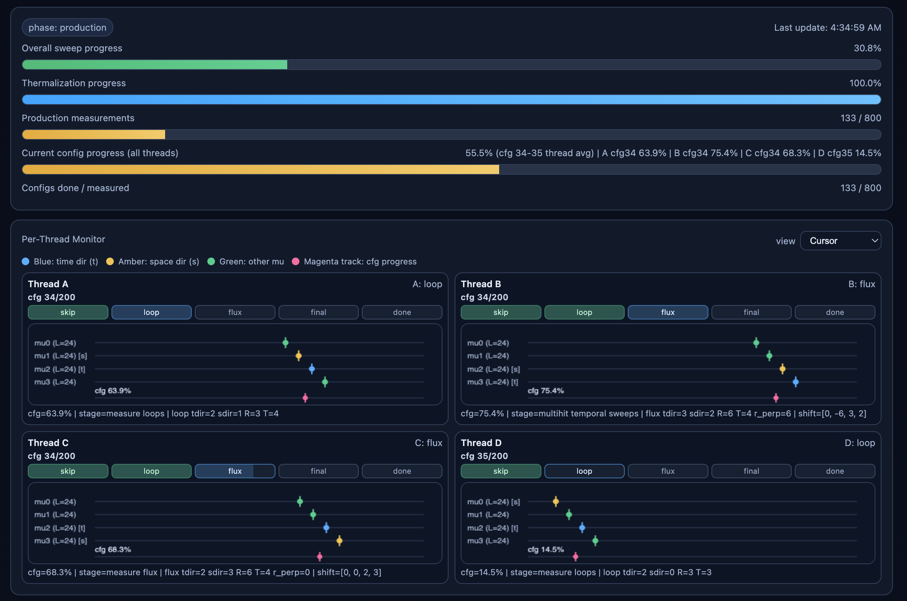
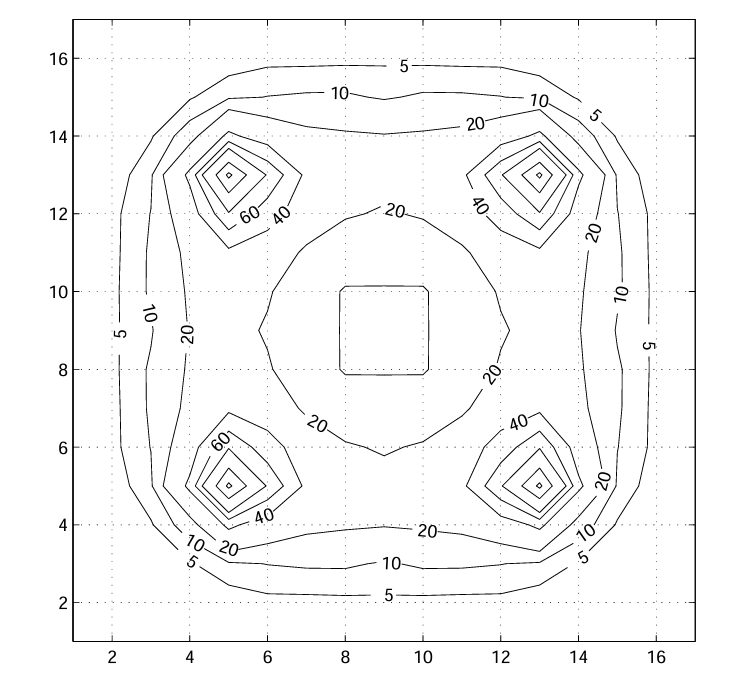
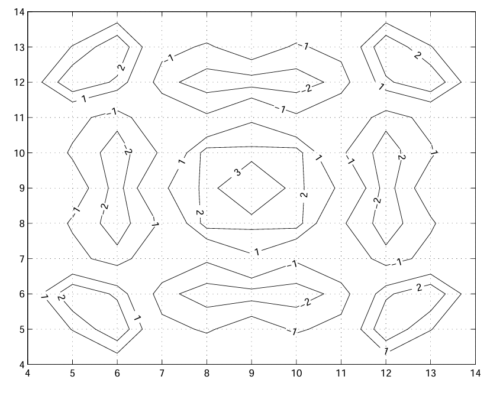
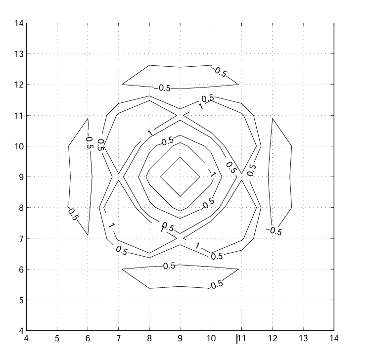
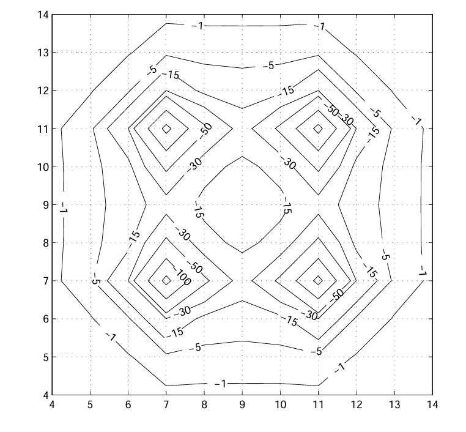

# Petrus Pennanen - Lattice QCD Flux-Tube Program

This repository contains the active Grid+GPT workflow used for high-statistics lattice QCD measurements of static-source potentials and chromofield flux profiles. The current production pipeline is focused on reliable long-run operation, statistically controlled error estimates, and live observability through a streaming dashboard.

## Scientific Program

The immediate target is to reproduce and extend earlier SU(2) flux-tube studies with better statistics, larger lattices, and tighter uncertainty control. The next stage is to move to multi-quark systems in SU(3), including 6-quark physics on collaboration gauge ensembles. A central long-term goal is to resolve flux-tube structure between two nucleons and quantify how confinement-scale dynamics may connect to nuclear-fusion-relevant effective interactions.

## Methods and Physics Outputs

The measurement engine separates thermalization from production, then samples observables from Wilson-loop and connected-correlator operators across multiple geometries. Smearing, operator averaging, and jackknife-based uncertainty estimation are integrated in the default pipeline, with covariance-aware fitting in post-processing. The dashboard and postprocessor report potential and flux observables in forms directly comparable across runs and volumes, while autocorrelation diagnostics are used to monitor effective sample independence.

The static potential is fit with the Cornell form

$$
V(R) = V_0 + \sigma R - \frac{e}{R},
$$

and the dashboard shows the fitted physical parameters $(\sigma, e, V_0, \chi^2/\mathrm{dof})$ alongside the measured $V(R)$ points. Flux profiles are displayed as connected-field measurements $\Delta P(r_\perp)$, and plaquette autocorrelation is tracked via $\tau_{\mathrm{int}}$ estimators during the run.

## Platform and Runtime

This codebase is actively maintained for both Linux and macOS, including Apple Silicon systems. Production runs are regularly executed on modern M-series MacBook, Mac mini, and Mac Studio machines as well as Linux workstations and servers. The orchestration scripts are POSIX shell plus `tmux`, and path handling is now environment-aware through variables such as `SU2_OUT_DIR` and `SU2_GPT_DIR`, so the same run definitions can move between hosts without hardcoded machine paths.

## Live Run Dashboard


*Main admin dashboard view with live phase/progress bars and per-thread cursor monitoring for concurrent SU(2) production workers.*

The dashboard streams live data from `progress_<seed>.json` and `live_<seed>.json` and is designed to answer two questions continuously: whether the run is healthy, and whether the physics estimates are converging. In the top dashboard view, the first section reports phase, global progress, measurement counts, and synchronized all-thread current-config progress. The Per-Thread Monitor then shows each worker's current config id, stage pipeline (`skip -> loop -> flux -> final -> done`), and live cursor positions in lattice-direction space.


*Physical-comparison diagnostics view captured from a production run on a MacBook M4 Pro after approximately 15 hours of continuous runtime.*

The second screenshot highlights the analysis side of the same page, especially the physical-comparison diagnostics used to benchmark extracted observables against reference scales and expected behaviors. This includes potential-fit outputs such as $\sigma$, $e$, $V_0$, $r_0$, and $r_1$, flux-profile diagnostics, and agreement-status indicators that are updated live during production.

### Analytical and Diagnostic Power

Beyond tracking progress, the dashboard provides automated physics interpretation:
- **Physics Extraction**: Real-time Cornell potential fitting, Sommer scale ($r_0, r_1$) determination, and flux tube width growth analysis.
- **Statistical Health**: Integrated autocorrelation time ($\tau_{int}$) calculation and Signal-to-Noise (SNR) monitoring for all observables.
- **Phase Detection**: Polyakov loop sector visualization for monitoring $Z_2$ center symmetry and confinement transitions.
- **Physical Benchmarks**: Automatic conversion of lattice observables to physical units (GeV/fm) for direct comparison with literature.

### Visualized Sections

- **Phase and global bars**: production/thermalization state, overall progress, production measurement count, and all-thread current-config progress.
- **Per-Thread Monitor (A/B/C/D)**: per-thread config id, stage pipeline (`skip -> loop -> flux -> final -> done`), and real-time cursor positions over lattice directions.
- **Cursor colors**: blue = time direction, amber = space direction, green = other directions, magenta = per-thread config progress track.
- **Observable Charts**: plaquette history (running mean + SEM), selected Wilson-loop history, flux profile $\Delta P(r_\perp)$, $V(R)$ with errors and Cornell fit readout $(\sigma, e, V_0, \chi^2/\mathrm{dof})$, plaquette autocorrelation $(\tau_\mathrm{int})$, and Polyakov-loop sector tracking by direction.
- **Admin Chat + Next Jobs**: run interpretation and suggested follow-up runs.

See [SU2_DASHBOARD.md](tools/SU2_DASHBOARD.md) for detailed setup and usage instructions.

## Selected Earlier SU(2) Papers

1. P. Pennanen, A. M. Green, C. Michael, *Flux-tube structure and beta-functions in SU(2)*, [Phys. Rev. D **56**, 3903 (1997)](https://doi.org/10.1103/PhysRevD.56.3903)
2. A. M. Green, P. Pennanen, C. Michael, *Flux-tube Structure, Sum Rules and Beta-functions in SU(2)*, [Nucl. Phys. B Proc. Suppl. **63**, 400 (1998)](https://doi.org/10.1016/S0920-5632(97)00721-4)
3. A. M. Green, P. Pennanen, *Interquark potential model for multiquark systems*, [Phys. Rev. C **57**, 3384 (1998)](https://doi.org/10.1103/PhysRevC.57.3384)
4. P. Pennanen, A. M. Green, C. Michael, *Four-quark flux distribution and binding in lattice SU(2)*, [Phys. Rev. D **59**, 014504 (1999)](https://doi.org/10.1103/PhysRevD.59.014504)

## Scientific Background

The current implementation is directly anchored to earlier SU(2) and SU(3) flux-tube studies. The figures below from *Four-quark flux distribution and binding in lattice SU(2)* summarize the action-density and binding-structure observables that motivate the present measurement program.

### Action Density
| 2-Quark | 4-Quark Planar | 4-Quark Planar |
| :---: | :---: | :---: |
|  |  |  |
| *Flux tube between two quarks* | *Four-quark flux* | *Four quark flux on a plane through the quarks* |

### Binding Action Density
| 4-Quark Planar | 4-Quark Planar |
| :---: | :---: |
|  |  |
| *Difference of four quark and two quark action densities* | *On a plane through the quarks* |

### First Excited State Binding Energy
| 4-Quark Planar | 4-Quark Planar |
| :---: | :---: |
|  |  |
| *On a plane through the quarks.* | *Binding energy of the first excited state* |

## Understanding Multiquark Flux Arrangement for Nuclear Fusion Dynamics

The programme's long-range target is to resolve the chromofield flux-tube
structure of the six-quark system — the quark-level picture of two nucleons at
sub-femtometre separation. This connects directly to nuclear fusion through
three mechanisms that are inaccessible to meson-exchange or effective-field-theory
descriptions alone:

**Short-range nucleon–nucleon interaction.**
At separations below ~0.5 fm the nucleon quark wave functions overlap and the
system must be treated as a six-quark state. The repulsive core of the nuclear
force — the barrier that fusion must overcome — originates from quark Pauli
blocking and the colour-magnetic interaction in this overlap region. Lattice
flux-tube measurements can spatially resolve the energy distribution that
produces the core, providing a first-principles complement to phenomenological
potentials (Argonne v18, Reid93).

**Binding flux distribution.**
The key observable is the binding action density
Δρ(**r**) = ρ_{6q}(**r**) − ρ_{3q+3q}(**r**),
which isolates the gluon-field energy that exists *only* when two nucleons are
close enough to interact. This quantity — already demonstrated for four-quark
systems [(Pennanen et al., 1998)](https://arxiv.org/abs/hep-lat/9804004) —
encodes the energy cost of flux-tube reorganisation during fusion and feeds
directly into the effective short-range potential that sets tunnelling
probabilities.

**Flux-tube reorganisation and the Karliner–Rosner reaction.**
[Karliner and Rosner (2017)](https://www.nature.com/articles/nature24289) showed
that quark-level baryon fusion can be strongly exothermic: merging two
bottom-quark baryons releases ~138 MeV via quark rearrangement. That
calculation used mass relations; the present programme aims to supply the
*microscopic mechanism* — the spatial reorganisation of colour flux tubes that
accounts for the energy release — from lattice QCD.

### Roadmap

| Phase | Scope | Fusion-relevant output |
|-------|-------|----------------------|
| Current | SU(2) two-quark flux profiles, high statistics | Methodology validation; variance-reduction benchmarks |
| Next | SU(2) four-quark binding flux | Reproduce multi-body subtraction method on modern codebase |
| Target | SU(3) six-quark flux distributions | First spatial images of the gluon field inside a fusing nucleon pair |
| Goal | Effective NN potential from binding flux | Quantitative short-range corrections to the astrophysical S-factor |

No other active lattice QCD programme targets the spatial chromofield
distribution in six-quark systems. The [HAL QCD](https://www.frontiersin.org/journals/physics/articles/10.3389/fphy.2020.00307/full)
and [NPLQCD](https://www.ub.edu/nplqcd/) collaborations extract potentials and
binding energies but do not resolve flux-tube geometry.

### Key references

- P. Pennanen, A. M. Green, C. Michael, *Four-quark flux distribution and binding in lattice SU(2)* — [Phys. Rev. D **59**, 014504 (1999)](https://doi.org/10.1103/PhysRevD.59.014504)
- A. M. Green, P. Pennanen, *Interquark potential model for multiquark systems* — [Phys. Rev. C **57**, 3384 (1998)](https://doi.org/10.1103/PhysRevC.57.3384)
- M. Karliner, J. L. Rosner, *Quark-level analogue of nuclear fusion with doubly-heavy baryons* — [Nature 551, 89 (2017)](https://www.nature.com/articles/nature24289)
- N. Ishii, S. Aoki, T. Hatsuda, *Nuclear force from lattice QCD* — [Phys. Rev. Lett. **99**, 022001 (2007)](https://doi.org/10.1103/PhysRevLett.99.022001)

## Repository Guide

The core runtime path is `gpt/applications/hmc/su2_2q_signal_scan.py` for measurement execution, `tools/su2_signal_postprocess.py` for post-processing and fit/error analysis, `tools/su2_dashboard_server.py` for live backend streaming, and `tools/su2_dashboard.html` for the frontend. Chained production orchestration lives in `tools/su2_chain_to_24.py`.

## Contributing and Discussion

Contribution workflow and coding standards are documented in [CONTRIBUTING.md](CONTRIBUTING.md). For run coordination, API discussion, and join-endpoint behavior (including intelligent-agent integration), use the Antfarm lattice-QCD room: <https://antfarm.world/messages/room/lattice-qcd>.

## License

This project is licensed under GPL-2.0. See [LICENSE](LICENSE) for the full text.

## Quickstart

```bash
python3 -m venv .venv
source .venv/bin/activate
pip install numpy
./scripts/validate.sh
```

## Validation and Baseline

`./scripts/validate.sh` (or `make test`) runs a deterministic baseline validation by generating a synthetic SU(2) live dataset, executing `tools/su2_signal_postprocess.py`, and checking a stable potential fit. The baseline observable is $V(R=2)=0.310280$ on the synthetic dataset, and CI accepts a robust regression window of $0.29 \le V(R=2) \le 0.33$.
